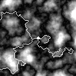

This is example output of road generator. Roads follow structure of underlying perlin noise terrain. This project uses [TwoDimMap](https://github.com/Linzee/twoDimMap) library for combining layers and saving output image.

## About generator
Road placement is affected by multiple factors:
- steepness of terrain (lowest possible)
- distance to other roads
- distance to city (point in center of map)
